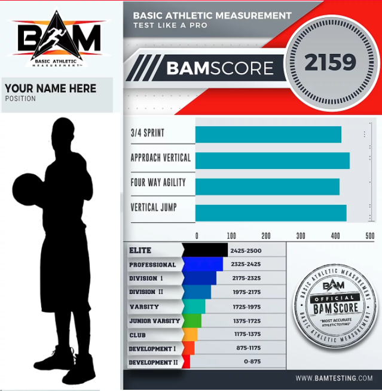
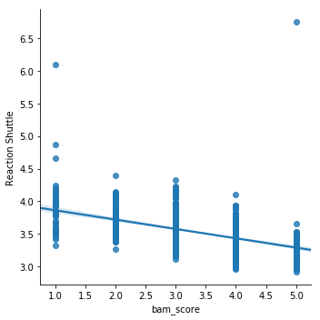

# From Plan A to The NBA

## Description

This project is an exploritory data analysis using NBA Combine assessment data from High School + Division 1 athletes who are trying to get to the next level. The purpose of this project is to identify:

1) How do athletes figure out strengths and weaknesses + how do they improve?
2) Which NBA Combine assessment is the biggest delineator for athletes that make it to the next level? 

Begin with story about high school/NCAA athletes and how it's hard to get to the next level.
Use stats from these websites/articles
http://www.ncaa.org/about/resources/research/probability-competing-beyond-high-school

- 6 amazing articles with stats to use

https://www.makeareadme.com/
https://gist.github.com/PurpleBooth/109311bb0361f32d87a2

Today, the probability of competing in athletics beyond high school is extremely slim. In fact, only 3.5% of high school basketball athletes end up competing at the college level. With such a slim chance of high school athletes making it to the next level, student athletes are beginning to plan, prepare and train younger and younger.

With this is mind, student athletes need to begin understanding how they compare to the competition. In order to get to that next level, student athletes need to be elite/above the rest and players/coaches need insight into their areas of improvement to help athletes reach the next level.

So how are players/coaches going to figure out areas of improvement, track progress, and understand their athletic strengths and weaknesses? Well I have the answer for you! 

Let me introduce you to BAM TESTING!
(ABOUT BAM)
BAM Testing created a standardized athletic performance assessment to provide quantitative evidence to quantitatively measure how athletes compare to the rest of the competition. With this quantitative data, BAM draws insight into athletes strengths and weaknesses through the BAM Score - A standardized assessment for critical insight into athletic strengths and weaknesses.

## Definition of NBA Combine Protocols and Anthros

Protocols (Athletic Tests - Power/Quickness)
- Approach Vertical
- Vertical Jump
- 3/4 Court Sprint
- 4-Way Agility
- Reaction Shuttle
- Bench Press - Max reps @ 185lbs
***(Not included in analysis because it's not a good indicator of success in basketball)
*** Ex. Kevin Durant (Top NBA Player) benched 0 reps at the combine.

Anthros (Body Measurements - Length/Size)
- Height
- Weight
- Body Comp
- Wingspan
- Reach
- Hand Length (Not included in analysis)
- Hand Width

## Import Libraries

import pandas as pd
import numpy as np
import matplotlib.pyplot as plt
import scipy.stats as scs
import seaborn as sns
import plotly.express as px
from sklearn.ensemble import RandomForestClassifier
from sklearn.preprocessing import maxabs_scale

What makes a good BAMScore?
(Martin)

Example of BAMScore

Process:

#1 Import Libraries and BAM Data Set
- pandas, numpy, matplotlib, scipy, seaborn, plotly, sklearn

#2 Clean Data
- Dropped Hand Length and blank columns messing up data
- Identified NAN's and blank columns then filled and replaced with means

#3 Create Ranks (1-5) for protocols and anthros
- Split scores into 5 groups

#4 Visualize Data
- Plotted ranks of all protocols and anthros to see distribution
- Plotted to find more outliers/data that did not make sense.

#5 More Cleaning/Scaling Data
- Removed outliers
- Scaled training data

#6 Created Random Forest Regression Model
- goal: figure out most important features in model

#7 Feature Importance Analysis
- Reaction Shuttle is the most important feature and highest delineator for rank

- plotted reaction shuttle with respect to BAMScore

#8 Scatter Matrix
- Created scatter matrix across all ranked columns to try and visualize more trends by looking for 45 degree patterns.

#9 More Visualization - Violin Plots
- Created 2 similar violin plots for each parameter with respect to BAMScore
(INSERT PICS AND TAKEAWAYS)

#10 Jarque-Bera Test + Threshold Identifier
- Ran Jarque-Bera test, which is a goodness of fit test, that tests whether the sample data has a skewness and kurtosis matching a normal distribution
- Created threshold identifier to visualize additional outliers I need to take out and find threshold cutoffs for each parameter.

(INSERT PICS)

#11 K-Nearest Neighbor Classifier
- Ran Classifier to determine which protocol contributes the most to BAMScore

#12 Decision Tree Regressor
- Ran 3 different Decision Tree Regressors
1) Relationship between all parameters - anthros + protocols
2) Relationship between protocols
3) Relationship between anthros

#13 Conclusion and Insight
- Vertical jump is not important for delineating BAMScores
- Reaction shuttle and 4-Way agility are the most important protocols that delineate BAMScores
- Overall On average, shorter athletes have better scores (except vertical jump and approach vertical)
- Shorter athletes are much better at agility/fast twitch based protocols

